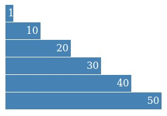
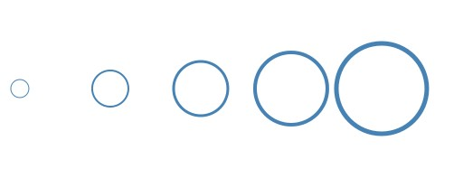

# Crear con datos

# D3.js

## D3.js ##

* [http://d3js.org/](http://d3js.org/)
* [Referencia del API](https://github.com/mbostock/d3/wiki/API-Reference)

## Setup ##

* Descargar la plantilla
* Crear una copia de la carpeta por ejercicio
* Desactivar **Caches** en la consola (F12) de Chrome 

# Ejercicios

## Ejercicio 1 ##

1. Añade al html un: **\<h1\>** que diga **Hola mundo**
2. Añade al html un: **\<p\>** que diga **Texto 1**
3. Añade al html otro: **\<p\>** que diga **Texto 2**
4. Pon en css el *background-color* del **\<body\>** de algún color
5. Ejecuta el siguiente código en la consola:

~~~~
	var paragraphs = document.getElementsByTagName("p");
	for (var i = 0; i < paragraphs.length; i++) {
		var paragraph = paragraphs.item(i);
		paragraph.style.setProperty("color", "white", null);
	}
~~~~

* ¿Qué pasa?


## Ejercicio 2 ##

1. Añade al html un: **\<h1\>** que diga **Hola mundo**
2. Añade al html un: **\<p\>** que diga **Texto 1**
3. Añade al html otro: **\<p\>** que diga **Texto 2**

4. Ejecuta el siguiente código:

	~~~
	d3.selectAll("p").style("color", "white");
	~~~

5. Ejecuta el siguiente código:

	~~~
	d3.select("body").style("background-color", "black");
	~~~~~~~~
	
<hr> 
* ¿Qué hacen **select** y  **selectAll**?
* ¿Qué hace **style**?

## Ejercicio 3 ##

1. Utiliza **d3.select**  para seleccionar el **\<body\>** y guarda la selección en una variable
2. Utiliza el método de la selección **append** para añadir al **\<body\>** un **\<p\>**, y guarda su salida (la selección al párrafo añadido) en una variable
3. Utiliza el método de la selección **text** para ponerle un texto al párrafo creado. 


# Data Bind

## Requisitos

* [Selección](https://github.com/mbostock/d3/wiki/Selections)
* Datos

## Datos

* Normalmente son **Arrays**
* Se pueden [cargar desde una url](https://github.com/mbostock/d3/wiki/Requests)

## Hacer la selección ##

* Se utilizan los [selectores de CSS](https://css-tricks.com/how-css-selectors-work/)

## Bind 1 ##

Crea varios elementos con **selectAll** y un **Array** de datos

	var datos = [1,10,20,30,40,50];
	
	d3.select('body')
	    .selectAll("p")  // Selección vacía
	    .data(datos)
	   .enter()          // Método mágico por ahora
	    .append("p")     // Añade el elemento p por cada dato
	    .text("Tengo texto");
    
Encuentra el \__data__ de esos párrafos con **console.log** y **F12**

## Bind 2 ##

Utilizar los datos para modificar atributos en consecuencia

	var datos = [1,10,20,30,40,50];
	
	d3.select('body')
	    .selectAll("p")
	    .data(datos)
	   .enter()
	    .append("p")
	    .text(function(d){return d;});
    
-------------------------------------------------------------------------------

* ¿Cómo haríais para que escribiera:?

		Párrafo 1
		Párrafo 10
		Párrafo 20
        Párrafo 30		
		Párrafo 40
		Párrafo 50


## Bind 3 ##

Funciones tan complicadas como queramos

	var datos = [1,10,20,30,40,50];
	
	d3.select('body')
	    .selectAll("p")
	    .data(datos)
	   .enter()
	    .append("p")
	    .text(function(d){return "Párrafo " + String(d);});
    


## Bind 4 ##

Primer parámetro son los **datos** segundo parámetro los **índices**

	var datos = [1,10,20,30,40,50];
	
	d3.select('body')
	    .selectAll("p")
	    .data(datos)
	   .enter()
	    .append("p")
	    .text(function(d, i){return "Párrafo " + String(i);});
    

## Bind 5 ##

Varios cambios encadenados

	var datos = [1,10,20,30,40,50];
	
	d3.select('body')
	    .selectAll("p")
	    .data(datos)
	   .enter()
	    .append("p")
	    .text(function(d, i){return "Párrafo " + String(i);})
	    .style("font-size", function(d){return String(d)+"px";});		

## Ejercicio 4 ##

* Basándote en el siguiente código, colorea de rojo los párrafos que tengan datos **superiores a 20**

		var datos = [1,10,20,30,40,50];
		
		d3.select('body')
		    .selectAll("p")
		    .data(datos)
		   .enter()
		    .append("p")
		    .text(function(d){return "Párrafo " + String(d);});

## Ejercicio 5 ##

* Basándote en el siguiente código, colorea de rojo los párrafos en posición impar

		var datos = [1,10,20,30,40,50];
		
		d3.select('body')
		    .selectAll("p")
		    .data(datos)
		   .enter()
		    .append("p")
		    .text(function(d){return "Párrafo " + String(d);});

## Ejercicio 6 ##

* Añade al CSS una regla que coloree de rojo los párrafos con clase **impar**
* Repite le ejercicio 5 pero esta vez añade una clase **impar** a los párrafos impares.

## Ejercicio 7 ##



----------------------------------------------------

* En vez de añadir párrafos añade **div** para crear un diagrama de barras horizontal
* El **height** de los divs debe ser 20px
* El **width** de los divs debe ser 5 veces su dato
* El **margin** de 1px
* El **background-color** debe ser **steelblue**

# Cargar datos de un fichero

## Cargar datos de un fichero

* La carga es **asíncrona**, se utiliza un **callback**:

		d3.csv("cars.csv", function(data) {
		
		    crearVisualizacion(data);
		    
		});

## Ejercicio 8 ##

* Carga los datos de **"[cars.csv](data/cars.csv)"**
* Crea un párrafo con el número de items leídos
* Inspecciona los datos en la consola: **console.log(data)**

# Pintar en SVG

## SVG es equivalente a HTML

<iframe width="100%" height="800" src="http://jsbin.com/gosama/embed?html,output">
	](../rsc/images/link.png)

</iframe>


## Contenedor SVG

* Crear el elemento:

		var svg = d3.select("body").append("svg");

* Siempre con tamaño

		//Se suelen utilizar: Width y height
		var width = 800;
		var height = 600;

		svg.attr("width", width)
		   .attr("height", height);

* O todo encadenado:

		var svg = d3.select("body")
            .append("svg")
            .attr("width", width)
            .attr("height", height); 

## Crear formas

* Selección > Data Binding > Enter > Append

```
var datos = [10,20,30,40,50];

var circles = svg.selectAll("circle").data(datos);

circles.enter()
    .append("circle");

circles.attr("cx", function(d, i) { return (i * 100) + 20; } )
    .attr("cy", height/2)
    .attr("r", function(d) {return d;});
```

## Ejercicio 9 ##



* Colorea los círculos de diferente color:
	* El borde (**stroke**) todos iguales de **steelblue**
	* El relleno (**fill**) sin color (**none**)
	* El ancho del borde (**stroke-width**) directamente proporcional a su dato 

## Ejercicio 10 ##


-------------------------------------------------------------------

* Haz un diagrama de barras **horizontal** en SVG con los pesos de los coches del dataset "cars"

* Utiliza **map** para recorrer el array de datos y **parseInt** para el casting de string a entero.

```
    var pesos = datos.map(
		function(d){
			return parseInt(d['weight (lb)']);
		}
    );
```
